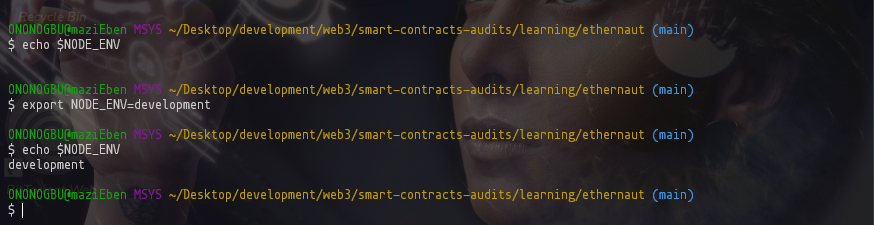
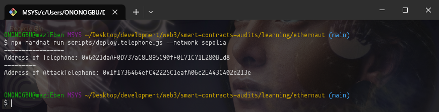
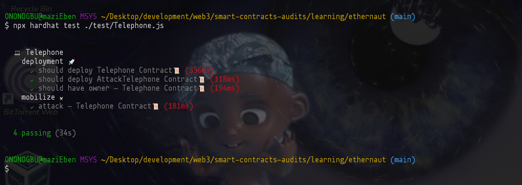

# Ethernaut CTF | Walkthrough 🚶‍♂️🚶‍♀️

<div id="header" align="center">
  
</div>

### Table of Contents

-   [Description](#description)
-   [Installation ⚔ Launching ](#installation-and-launching)
    -   [Installation](#installation-💻)
    -   [Setting up Environment](#setting-up-environment-⛏)
    -   [Launching](#launching-🚀)
-   [Mobilize for Battle | Attack](#mobilize-for-battle--attack-⚔💣)
-   [Learn More](#learn-more-🧐)

## Description

This project contains Smart contracts, POCs, scripts, and tests that are used to tackle [OpenZeppelin's Ethernaut CTFs](https://ethernaut.openzeppelin.com/). Feel free to peruse through the contracts, scripts, and test directories to see the approach used to hack the contracts.
Please refer to the corresponding [OpenZeppelin's Ethernaut CTF](https://ethernaut.openzeppelin.com/) for whatever contract you choose.

## Installation and Launching

For ease of use, windows users should opt for either using Git Bash or WSL Shell as the shell commands here are Linux based.

### Installation 💻

-   Run the following command(s) below to clone this repository in any directory in your local machine:

```sh
git clone https://github.com/E-Zbox/ethernaut-walkthrough.git && cd $_
```

-   While in the cloned repository, run the command below to install project dependencies:

```sh
npm install
```

-   On completion of installation, follow [this guide](https://www.npmjs.com/package/solc) to tweak your **solc** compiler so that you can successfully compile the smart contracts in the project/

### Setting up Environment ⛏

Having successfully installed project dependencies with no issues (all issues resolved), we need to set up the project environment. If you peruse through the root directory of the cloned repository, you'd find a file with the name _.env.development_, we need to configure an environment variable so that our _hardhat.config.js_ file can read this env file successfully.

To configure the environment, execute `export NODE_ENV=development` on your terminal. To confirm, execute `echo $NODE_ENV` to get the set value.



Open the _.env.development_ file and replace the 'API-KEY' placeholder with your [Infura API key](https://infura.io).
An alternative is to navigate to [Quicknode](https://www.quicknode.com/), sign-in, navigate to endpoints and select _Sepolia network_. Copy the url and replace the 'https...infura.io...' in your _.env.development_ file with it.

### Launching 🚀

-   [x] Installation
-   [x] Setting up the environment
-   [ ] Launch ??

With everything done so far, it's time to compile `npx hardhat compile` our smart contracts in the **contracts** directory. This generates an **artifacts** directory that contains directories for **ABIs** generated and **build info**.

On successful compilation, we deploy on our test network **Sepolia** by executing the command `npx hardhat run scripts/deploy.[contract file you want to deploy].js --network sepolia`. In normal circumstances, the contract(s) should get deployed successfully and contract addresses should get printed out on the console.

<div id="header" align="center">
  
</div>



Feel free to interact with the contract in `npx hardhat console --network sepolia` and attach the ContractFactory where necessary. For more information about interacting with a deployed smart contract peruse through [Ethers.js Docs](https://docs.ethers.org/v5/api/contract/contract/#Contract-attach).

### Mobilize for Battle | Attack ⚔💣

You can see a demo of the contracts being attacked by running any of the tests that align with the contract's name.

Example:

To attack the **Telephone** contract, you execute the following command in the terminal after compiling the SC `npx hardhat test ./test/Telephone.js`. The series of test would get executed and the attacker gets to claim ownership of the contract.



### Learn More 🧐

The resources below have a deal of information that explain the above concepts deeper.

-   [Hardhat](https://hardhat.org/hardhat-runner/docs/getting-started#quick-start)
-   [Ethers Docs](https://docs.ethers.org/v5/)
-   [Solidity Documentation](https://docs.soliditylang.org/)
